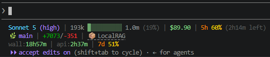

# claude-statusline

A 2-line status bar for [Claude Code](https://claude.com/claude-code), showing model/effort, context usage, and rate limits at a glance.

## Preview



## Layout

```
Opus 5 (medium) | 0 ░░░░░░░░░░ 1.0m (0%)
window 5h 0% · week 0%
```

1. **Model + effort | context bar**: used tokens, a 10-cell bar, total context window, and % used
2. **window 5h | week**: 5-hour and 7-day rate limit usage

Percentages and the context bar are color-coded: green (<50%) → yellow (≥50%) → orange (≥70%) → red (≥90%).

Line 2 is omitted when Claude Code supplies no rate-limit data.

## Install

```bash
git clone https://github.com/n0nuser/claude-statusline.git ~/.claude/claude-statusline
chmod +x ~/.claude/claude-statusline/statusline.sh
```

Add to `~/.claude/settings.json`:

```json
{
  "statusLine": {
    "type": "command",
    "command": "bash ~/.claude/claude-statusline/statusline.sh"
  }
}
```

Restart Claude Code (or start a new session) to pick up the change.

## Requirements

- `bash`, `jq`
- A terminal with 256-color support

## Update

```bash
cd ~/.claude/claude-statusline && git pull
```

## License

MIT
